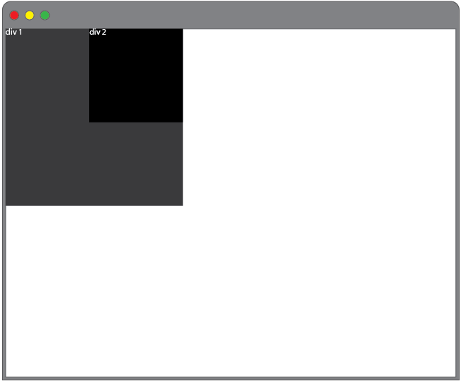
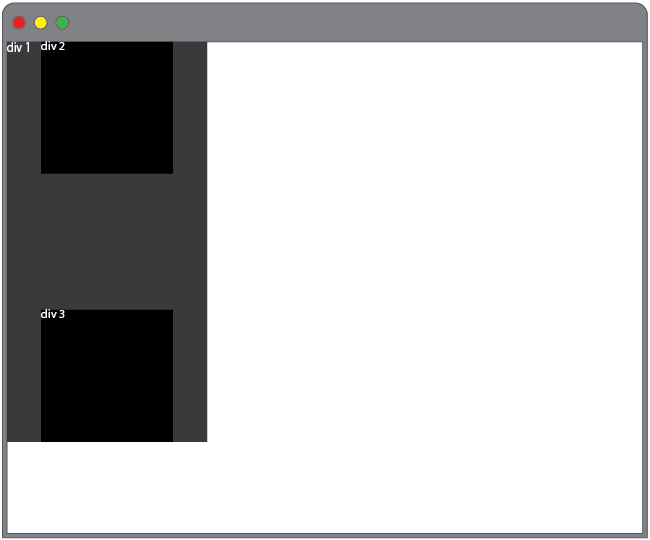
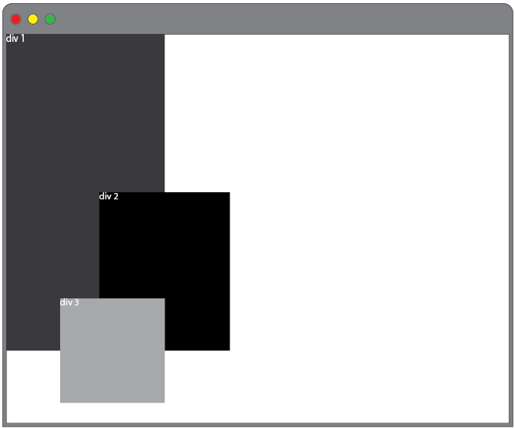

### Credit @ (https://github.com/turingschool-examples/css-layout-challenges)

### CSS Layout Challenge

As a front end developer, you will often be handed comps from a designer that you then have to build. You will need to be able to take a graphic file and recreate it with code. This means that you'll have to be able to think through how you're going to get all the elements in that comp where they need to be, and that requires a solid understanding of how to position HTML elements with CSS.

#### Getting Started

In this exercise, we'll take a series of simple comps and recreate each in [CodePen](http://codepen.io/). You will make the appropriate number of `<div>` tags with the div numbers indicated in the comps, give them a `<height>`, `<width>`, and `background-color` and then make them match the layout in the comp. Here's an example of what this might look like in your HTML and CSS:

Your HTML:

```HTML
<div class="div1">
  div1
</div>

<div class="div2">
  div2
</div>
```
Your CSS:

```CSS
div {
  width: 100px;
  height: 100px;
  background-color: black;
  color: white;
}
.div1 {
  float: right;
}

.div2 {
  float: left;
}
```

#### Tips:
* Remember, we've talked about several ways to position elements on the page. These include but are not necessarily limited to `display: block` and `display: inline-block`, `position: relative` and `position: absolute`, `margin`, `padding`, and the infamous `float`.
* If the layout dictates, some of the divs may be nested within other divs. Use your best judgement!
* See how many different ways you can achieve the same result and consider the pros/cons of solution!


### The Comps


##### Challenge 1: [Solution](https://codepen.io/kgalejandrino/pen/ExyRojZ)
Added two extra div. First div is nested to a div with an id of "left" and float it to the left. While the second and third div is also nested to a div with an id of "right" and float it to the right. As div are block elements, I set their display property to "inline-block" so that div2 and div3 sit next to each other. 


##### Challenge 2: [Solution](https://codepen.io/kgalejandrino/pen/XWKYVdN)
Taking advantage of float & margin. Div1 is already placed to where it should be. By setting div2's margin to auto, it will horizontally center div2 within its container and take up the specified width, the remaining space will be split equally between left & right margins. To move div3 far right, we can float it to the right. 


##### Challenge 3: [Solution](https://codepen.io/kgalejandrino/pen/ZEORvBO)
I nested div2 within div1. With this, I can absolutely positioned div2 within div1 (parent container, which is position relatively) and set its offset left & top property to 25% to center div2 container. It is set to 25% because we should take account of the width & height of the container. Again, I simply set the div1's margin to auto to equally center it horizontally.  


##### Challenge 4: [Solution](https://codepen.io/kgalejandrino/pen/qBNKbNp)
An element with position relative moves the element away from its default position while the other elements around it still behaves as if that element is statically positioned. We can overlap div2 with div1, by setting its position to relative and move 50px away from the bottom & left.


##### Challenge 5: [Solution](https://codepen.io/kgalejandrino/pen/ZEORvRe)
This is one is quite similar with challenge 2. The only difference was that floating div1 to right will put div2 on the same line as div1. To avoid that, I used CSS property __clear__ and set it to right so that there will be no floating elements to the right.


##### Challenge 6: [Solution](https://codepen.io/kgalejandrino/pen/zYBaJoN)
I nested div2 and div3 inside div1. I then set the position of div1 to absolute, and set an offset property of bottom:0 and right: 0 so that it will be positioned at the bottom right corner of the page. The same thing with div2 and div3, I set its position to absolute so that I can easily positioned them relative to div1 (which is the parent container). I set an offset property of bottom:0 & left: 0 for div2 and top:0 & right:0 for div3.


##### Challenge 7: [Solution](https://codepen.io/kgalejandrino/pen/pobKOay)
I nested div2 inside div1. Challenge can be easily achieved with position relative & absolute. Setting div1 to position relative, div2 can be absolutely positioned relative to div1 (parent container). Using an offset property of bottom:0 & right: 0, div2 will be move to the bottom right corner of the page. 


##### Challenge 8: [Solution](https://codepen.io/kgalejandrino/pen/pobKOLy)
Very similar with Challenge 7. To move div2 to the top right corner of the page, I just set top:0 & right:0. Again, this can be achieved with position absolute & relative.




##### Challenge 9: [Solution](https://codepen.io/kgalejandrino/pen/LYZrJBr)
Nested div2 & div3 inside div1. With position relative & absolute, we can easily move child containers where we want them to be. I set the position of div1 (parent container) to relative. Div2 & Div3 on the otherhand is set to absolute, and will be absolutely positioned relative to div1. Div2 is set to an offset property of top:0 so it will be move to the topmost part of the page. Since, width of the child element is already 50% of the parents width, we can center child element horizontally by setting its margin-left:25%. Same thing with div3, only it is set to an offset property of bottom: 0, to place it at the bottommost part of the page. 




##### Challenge 10: [Solution](https://codepen.io/kgalejandrino/pen/jOrKeNV)
Again, nested div2 & div3 inside div1. With div1 positioned to relative, we can absolutely positioned its child element relatively to it. I think the tricky part here is getting div2 & div3 to the correct position. Since div2 & div3 is set to position absolute I used the offset property to move it around and place it equally on each side as possible.  


##### Challenge 11:


##### Challenge 12:




##### Challenge 13:


##### Challenge 14:


##### Challenge 15:


